# vps-server

**简体中文** | [English](doc/en/README.md) | [Español](doc/es/README.md)

在一个 Web 控制台中管理 VPS 测速, 代理, FRP 和 Tailscale, 减少重复的终端操作.

[](LICENSE) [](https://github.com/CharlesGool/vps-server/releases/tag/v5.3.0)

## 文档

- 项目概览: [README](README.md)

- 设计思路: [DESIGN](doc/DESIGN.md)

- 项目状态: [LOG](doc/LOG.md)
- 历史记录: [HISTORY](doc/HISTORY.md)
- 变更日志: [CHANGELOG](doc/CHANGELOG.md)

- 第三方声明: [THIRD_PARTY_NOTICES](doc/THIRD_PARTY_NOTICES.md)

## 简介

- 浏览器上传/下载测速, 访客记录, 限时 iperf3 服务端与客户端测试.
- Singbox 托管 AnyTLS, VMess, VLESS, Trojan 和 Shadowsocks 节点, 支持分享, 配额, 限速与到期策略.
- FRPS 服务端, FRPC 实例及 TCP/UDP 代理管理, Lucky 原生管理入口, Tailscale 状态与设备管理.
- 模块按需安装, 端口转发, 详细日志, 密码保护的浏览器 root 终端, 三语言与主题设置.
- 默认只安装 Web, 公开可达性页面默认关闭. 已知问题与验证边界见 [LOG](doc/LOG.md#缺陷).

### 界面预览

以下为 v5.3.0 发布前测试构建在测试环境的实拍, 使用简体中文界面. 展示已安装模块, 创建表单和 Tailscale 未登录状态;默认安装仍仅包含 Web. 地址与凭据保持隐藏, 日志截图只展示分类和筛选控件.

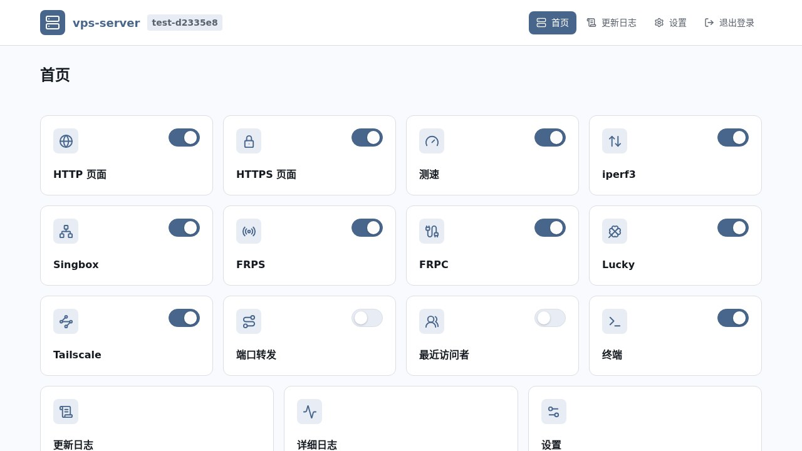

<details>
<summary>登录与测速</summary>

**登录**

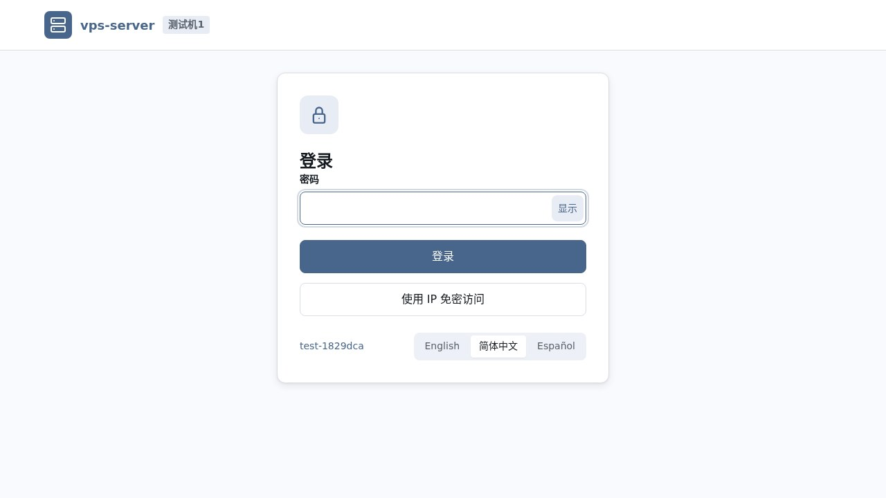

**iperf3 服务端与客户端**

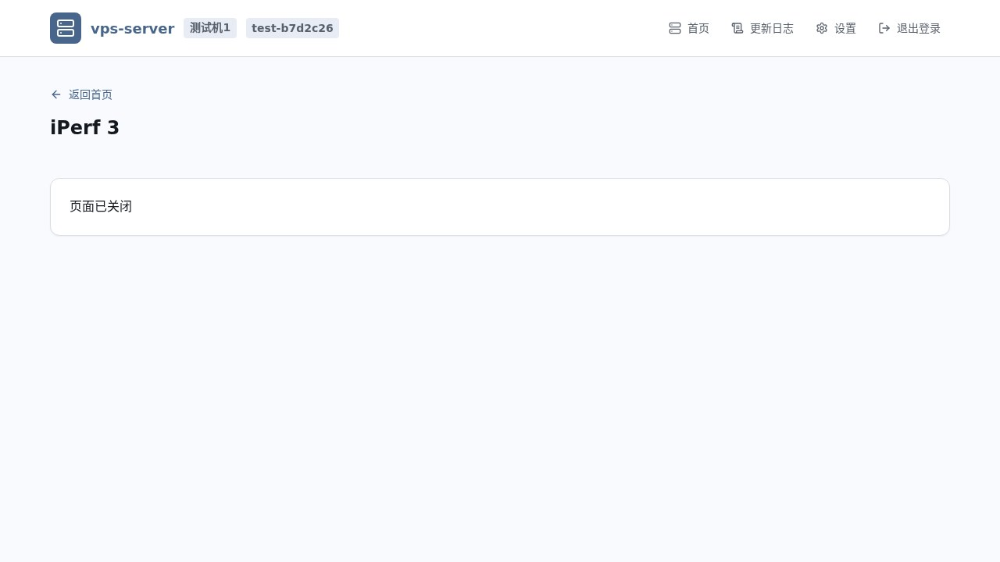

</details>

<details>
<summary>Singbox 与 FRP</summary>

**Singbox 节点概览**

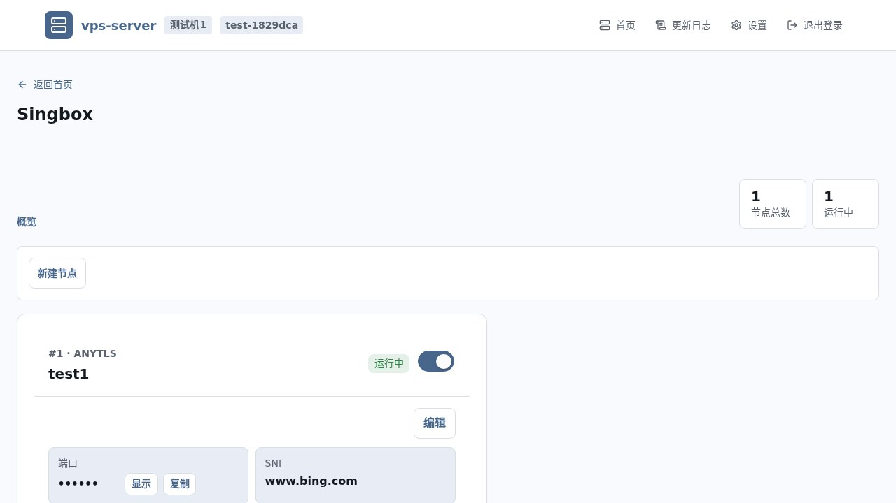

**创建 Singbox 节点**

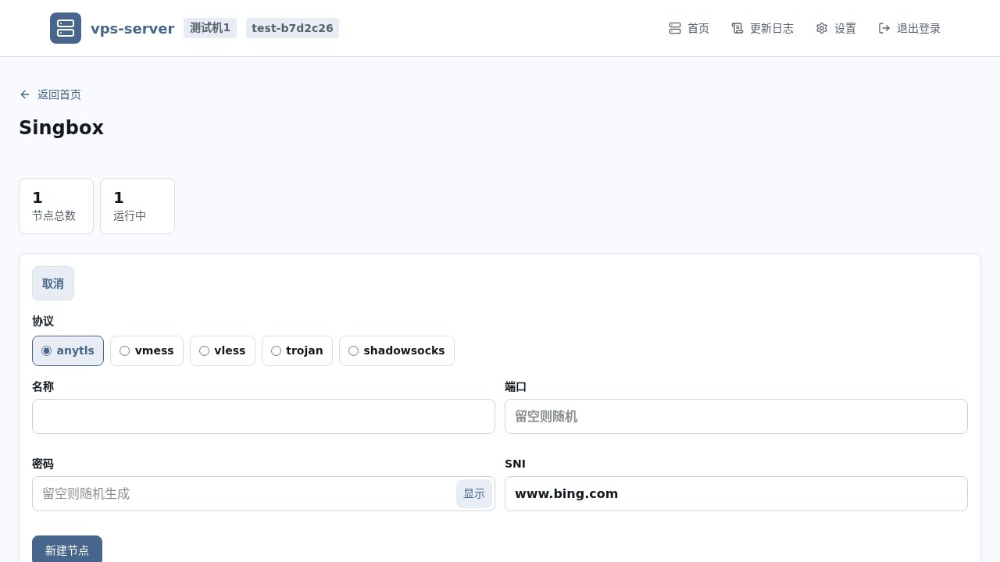

**Singbox 访问管理**

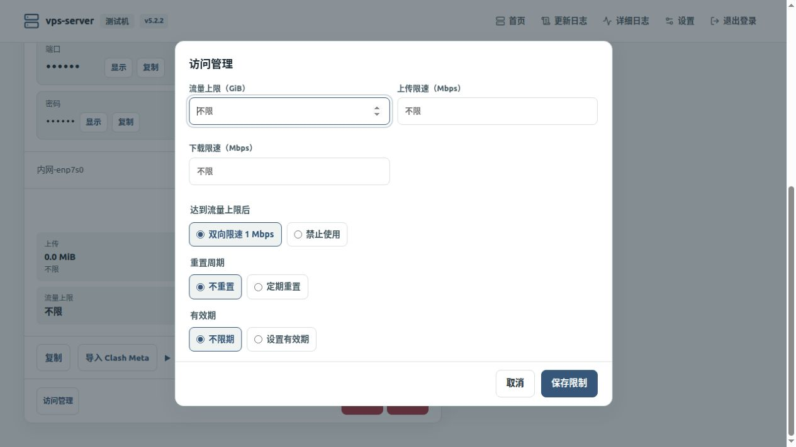

**FRPS 服务端**

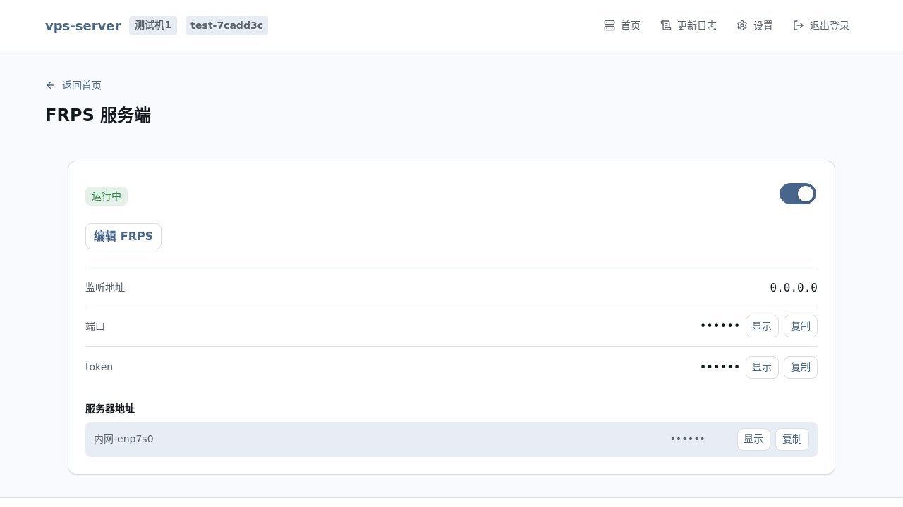

**创建 FRPC 实例**

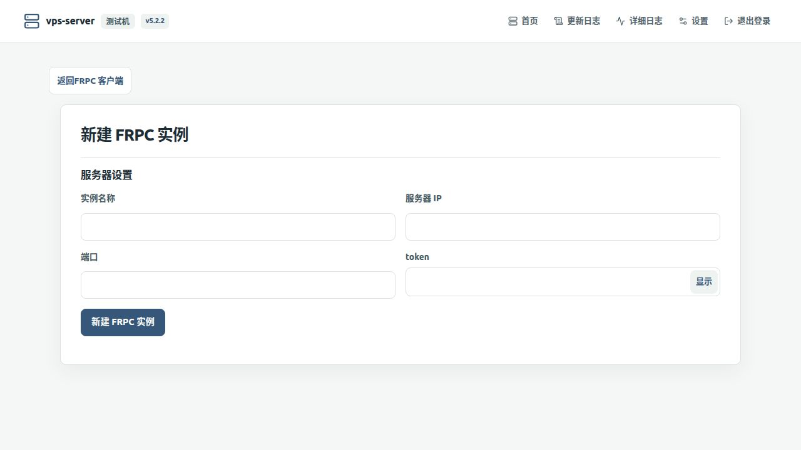

</details>

<details>
<summary>Tailscale</summary>

**Tailscale 概览与连接表单**

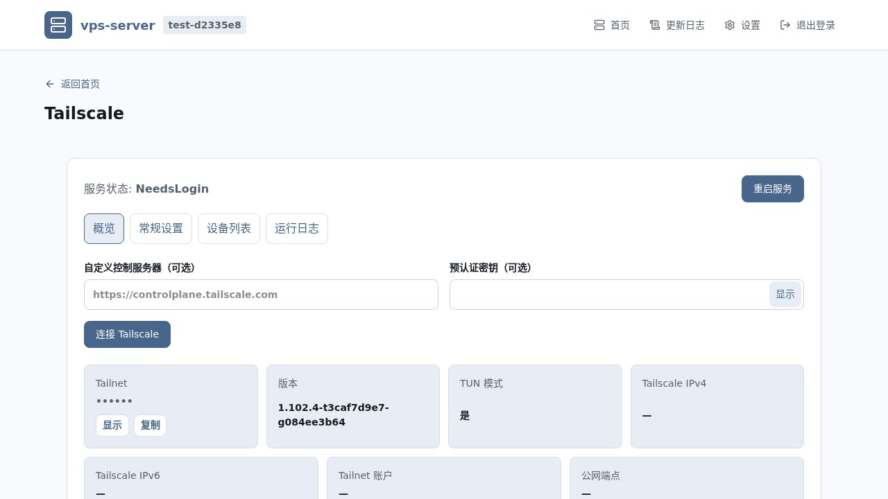

**Tailscale 常规设置**

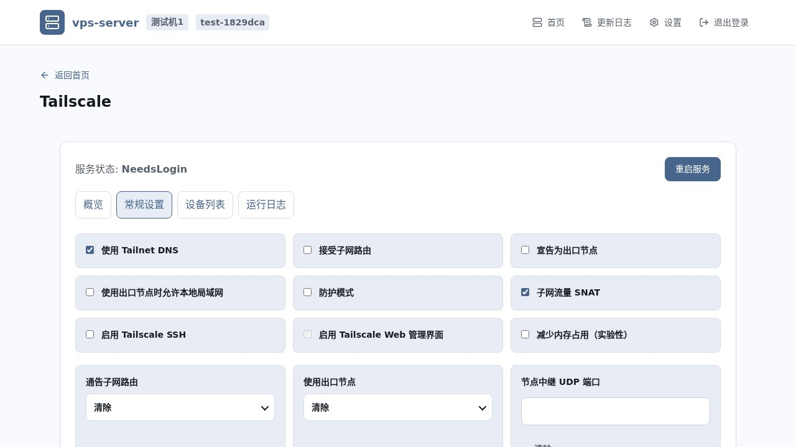

**Tailscale 日志筛选**

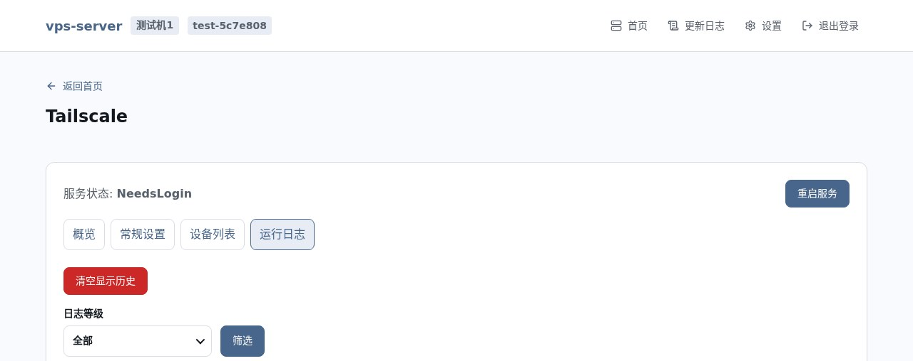

</details>

<details>
<summary>设置与日志</summary>

**主题与语言设置**

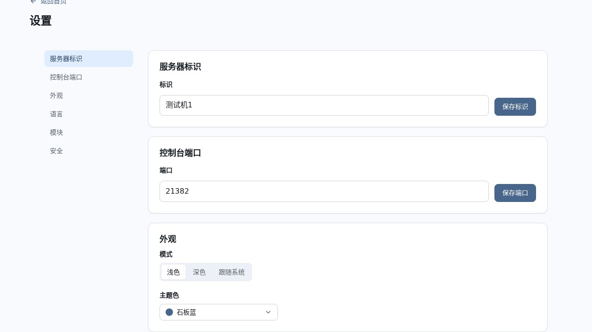

**模块管理**

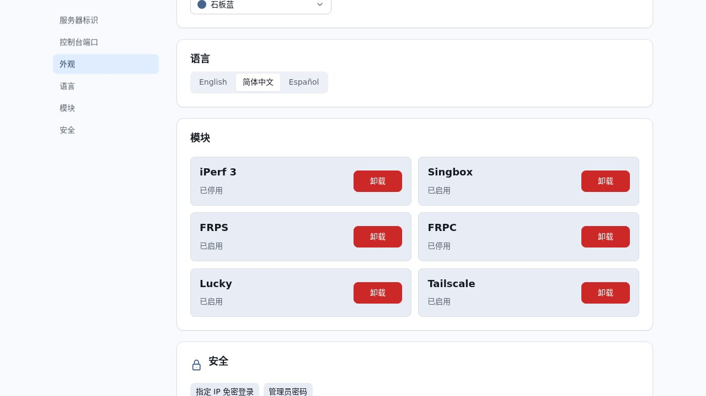

**管理员密码验证**

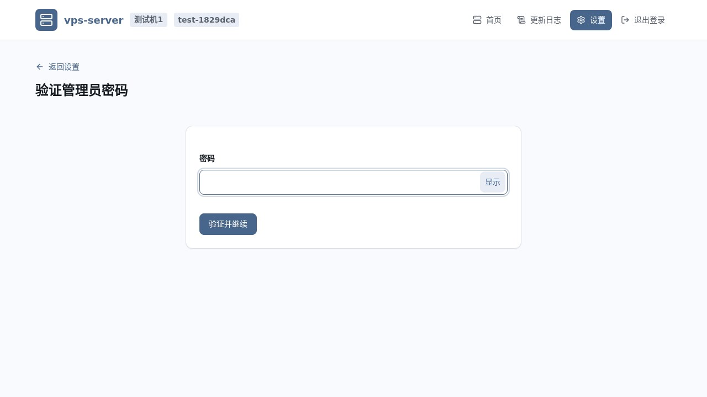

**详细日志分类与筛选**

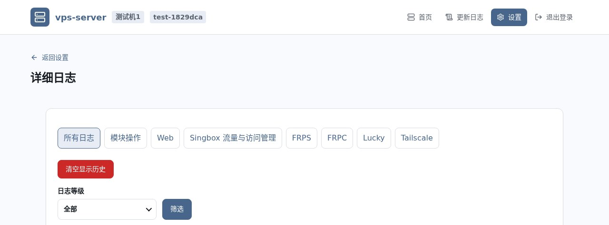

**更新日志**

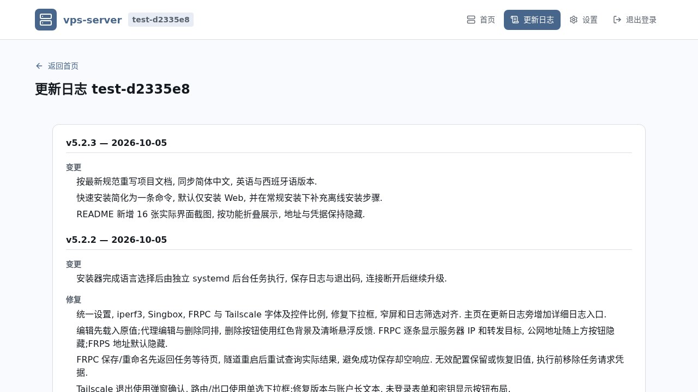

</details>

## 要求

最低要求: x86-64 Linux, systemd, root 权限, Python 3.9+, Bash 及可写的安装/状态目录. 安装器面向 Debian 11+ 与 Ubuntu 20.04+;其他架构不支持.

推荐使用维护中的 Debian/Ubuntu, 保留备份空间并开放选用功能的端口. Debian 13 x86-64 已实机验证;Python 3.9 和其他发行版未独立验收. 完整 Release 包包含离线构件, 但缺少系统基础包时仍需可用的软件包仓库. 源码构建完整离线包需要联网.

## 安装

以 root 执行.

### 快速安装

一条命令只安装 Web 页面, 其他模块在设置/模块中按需添加.

```bash
curl -fL https://github.com/CharlesGool/vps-server/releases/download/v5.3.0/vps-server-v5.3.0-linux-amd64.tar.gz | tar -xz -C /root && VPSSRV_MODULES=web bash /root/vps-server/deploy/install.sh
```

### 常规安装

源码安装需先在 `web/` 构建前端(Node.js 24), 并包含 Tailscale 归档, 但私有 nftables 运行库只在完整离线包中提供. `cp` 步骤可省略;需要定制时先编辑 `.env`.

```bash
git clone --depth 1 --branch v5.3.0 https://github.com/CharlesGool/vps-server.git /root/vps-server-source
cd /root/vps-server-source
(cd web && npm ci && npm run check)
cp .env.example .env
bash deploy/install.sh
```

#### 离线安装

在联网机器下载 [完整安装包](https://github.com/CharlesGool/vps-server/releases/download/v5.3.0/vps-server-v5.3.0-linux-amd64.tar.gz)和 [SHA256SUMS](https://github.com/CharlesGool/vps-server/releases/download/v5.3.0/SHA256SUMS), 传到目标机的 `/root/vps-server-download/`, 然后执行. 目标机需预先具备上述系统基础依赖.

```bash
cd /root/vps-server-download
sha256sum -c SHA256SUMS
mkdir -p /root/vps-server-v5.3.0
tar -xzf vps-server-v5.3.0-linux-amd64.tar.gz -C /root/vps-server-v5.3.0 --strip-components=1
cd /root/vps-server-v5.3.0
VPSSRV_MODULES=web bash deploy/install.sh
```

完成语言选择后, 安装交给 systemd 后台任务执行. 源码目录在任务完成前**必须**保留. 默认路径下查看日志和结果:

```bash
tail -f /root/apps/vps-server/.local/install-job/install.log
cat /root/apps/vps-server/.local/install-job/exit-code
```

`exit-code` 不存在表示未完成, `0` 表示成功, 其他值表示失败. 自定义 `PREFIX` 时替换日志路径. 完成后日志给出控制台地址, 初始密码和模块结果;终端断开不代表安装失败.

## 指南

安装结束后用日志给出的地址和密码登录. 在设置/模块中安装所需组件, 然后管理节点, FRPC 实例或限时测速. 地址和凭据默认隐藏;编辑表单加载原值. 浏览器 root 终端和安全设置需要再次验证管理员密码. Tailscale 未登录时先连接并完成认证, 子网路由仍需 Tailnet 管理端批准.

配置模板: [.env.example](.env.example). 所有变量都有默认值, 不要求填写凭据. 路径使用绝对路径, 开关为 `0/1`, 端口为 `1-65535`(控制台 `0` 例外), 数量和时长为整数. 除 `PREFIX` 与首次 `VPSSRV_STATE_DIR` 外, 以下项保存在状态根 `.env`, 修改后重启 Web;模块初始参数在安装模块时生效.

| 参数 | 默认值 | 含义 |
| --- | --- | --- |
| `PREFIX` | `/root/apps/vps-server` | 代码安装目录, 安装/卸载环境参数;在 `.env` 设置无效. |
| `VPSSRV_STATE_DIR` | `/var/lib/vps-server` | 首次安装的状态根环境参数;修改 `.env` 不迁移数据. |
| `VPSSRV_DATA_DIR` | 空 | 数据目录;空值使用状态根下 `data/`. |
| `VPSSRV_CERT_DIR` | 空 | 证书目录;空值使用状态根下 `certs/`. |
| `VPSSRV_PUBLIC_ENABLE` | `0` | 公开可达性页面开关, 1 开启. |
| `VPSSRV_PUBLIC_HTTP_PORT` | `80` | 公开 HTTP 监听端口. |
| `VPSSRV_PUBLIC_HTTPS_PORT` | `443` | 公开 HTTPS 监听端口. |
| `VPSSRV_HOST` | `0.0.0.0` | Web 监听地址. |
| `VPSSRV_CONSOLE_PORT` | `0` | 控制台端口;0 自动选择 20000-59999 并保存. |
| `VPSSRV_CONSOLE_PORT_FILE` | 空 | 端口文件;空值使用状态根下 `console_port.txt`. |
| `VPSSRV_CONSOLE_TLS` | `0` | 控制台 TLS 开关. |
| `VPSSRV_AUTH` | `1` | 控制台认证开关;0 允许无认证访问管理功能. |
| `VPSSRV_PASSWORD_FILE` | 空 | 管理员密码文件;空值使用状态根下 `admin_password.txt`. |
| `VPSSRV_IP_ALLOWLIST_FILE` | 空 | 免密 IP 清单文件;空值使用状态根下默认清单. |
| `VPSSRV_LOGIN_MAX_ATTEMPTS` | `5` | 登录窗口内最大失败次数. |
| `VPSSRV_LOGIN_WINDOW_SECONDS` | `60` | 统计登录失败的窗口秒数. |
| `VPSSRV_LOGIN_LOCKOUT_SECONDS` | `30` | 超限后的锁定秒数. |
| `VPSSRV_TLS_CERT` | 空 | 自备 TLS 证书路径;与密钥同时指定. |
| `VPSSRV_TLS_KEY` | 空 | 自备 TLS 私钥路径;未指定时生成自签名证书. |
| `VPSSRV_IPERF_ENABLE` | `1` | iperf3 功能开关. |
| `VPSSRV_IPERF_PORT` | `5201` | 限时服务端监听端口. |
| `VPSSRV_IPERF_DEFAULT_MINUTES` | `10` | 服务窗口默认分钟数. |
| `VPSSRV_IPERF_MAX_MINUTES` | `60` | 服务窗口最大分钟数. |
| `VPSSRV_PORTFWD_ENABLE` | `1` | 端口转发功能开关. |
| `VPSSRV_PORTFWD_MAX_RULES` | `20` | 最多保存的转发规则数量. |
| `VPSSRV_TRACK_CONNECTIONS` | `1` | 采集内核 TCP 连接记录. |
| `VPSSRV_CONN_POLL_SECONDS` | `5` | 连接采集间隔秒数. |
| `VPSSRV_TRUST_PROXY` | `0` | 信任代理地址头;仅用于受控反向代理, 开启后禁用 IP 免密登录. |
| `VPSSRV_MAX_TEST_MB` | `200` | 单次浏览器测速传输上限, MB. |
| `VPSSRV_TEST_SECONDS` | `10` | 测速测量时长, 秒. |
| `VPSSRV_WARMUP_SECONDS` | `2` | 不计入测速结果的预热秒数. |
| `VPSSRV_DOWNLOAD_STREAMS` | `6` | 并行下载流数. |
| `VPSSRV_UPLOAD_STREAMS` | `3` | 并行上传流数. |
| `VPSSRV_PING_SAMPLES` | `20` | 延迟测量样本数. |
| `VPSSRV_DEFAULT_LANG` | `en` | 默认语言: `en`, `zh_cn`, `es`. |
| `VPSSRV_PROXY_CONFIG` | `/etc/vps-server-proxy/config.json` | 统一代理配置路径. |
| `VPSSRV_PROXY_SERVICE` | `vps-server-proxy.service` | 统一代理服务名称. |
| `PROXY_PROTOCOLS` | 空 | 逗号分隔的协议子集;空值安装全部五种协议. |
| `PROXY_SNI` | `www.bing.com` | VMess, VLESS 与 Trojan 初始 TLS SNI. |
| `PROXY_ANYTLS_PORT` | 空 | 该协议初始端口;空值自动选择. |
| `PROXY_ANYTLS_PASSWORD` | 空 | 该协议初始凭据;空值自动生成. |
| `PROXY_VMESS_PORT` | 空 | 该协议初始端口;空值自动选择. |
| `PROXY_VMESS_UUID` | 空 | 该协议初始凭据;空值自动生成. |
| `PROXY_VLESS_PORT` | 空 | 该协议初始端口;空值自动选择. |
| `PROXY_VLESS_UUID` | 空 | 该协议初始凭据;空值自动生成. |
| `PROXY_TROJAN_PORT` | 空 | 该协议初始端口;空值自动选择. |
| `PROXY_TROJAN_PASSWORD` | 空 | 该协议初始凭据;空值自动生成. |
| `PROXY_SS_PORT` | 空 | 该协议初始端口;空值自动选择. |
| `PROXY_SS_PASSWORD` | 空 | 该协议初始凭据;空值自动生成. |

安装器另外接受环境参数 `VPSSRV_MODULES`(逗号分隔的 `web,iperf3,proxy,frps,lucky,tailscale`, 首装默认 `web`, 重装保留已有模块)和 `SERVICE_NAME`(默认 `vps-server-web`). 卸载参数 `KEEP_DATA=1` 保留数据. 这些参数不是 Web 配置项.

维护源码时执行 `python3 tools/check-project/check_project.py`. 需要 Git, Bash, Python 3.9+ 和 Node.js 24;Node.js 用于前端构建及 JavaScript 检查, 服务器运行不需要它. 非 PATH 中的 Node.js 可用 `--node /绝对路径/node` 指定. 工具目录由 `tools/build_styles`, `tools/build_offline`, `tools/verify_dependencies` 改为对应的 `build-styles`, `build-offline`, `verify-dependencies`;旧维护命令需替换路径, 安装命令不变. 该命令不启动服务, 不替代真实部署验收.

开发分支的源码安装前, **必须**先在 `web/` 执行 `npm ci && npm run check` (构建需要 Node.js 24). 完整离线包已含前端产物, 测试机运行不需要 Node.js. 统一检查也会执行前端设计, 类型和生产构建检查.

## 升级

布局 1 的 v5.1.1 测试版和 v5.2.x 可按上述安装步骤升级. 先备份状态根, `/etc/vps-server-proxy`, `/etc/vps-server-frps`, FRPC 实例配置与 Lucky 原生配置, 再在安装目录之外解包新版本, 使用相同 `PREFIX` 和状态根执行安装. 密码, 端口, 证书, 会话与模块设置按现行布局保留;源码目录不再承担持久数据职责.

v5.1.0 及更早版本使用旧布局, 不支持自动迁移. **必须**先备份旧安装目录及模块配置, 再全新安装并手动恢复所需设置. 缺少状态定位文件或检测到旧布局时安装器会拒绝原地升级;不要先删除旧目录.

确认后台退出码为 `0`, `systemctl is-active vps-server-web` 返回 `active`, 控制台显示 v5.3.0, 原密码可登录, 节点和 FRPC 配置仍存在, 所需模块及端口正常. 自定义服务名时替换命令. 失败时保留日志和备份, 不把部分完成视为升级成功.

## 卸载

第一组命令快速卸载并保留程序及配置/数据, 第二组完全卸载. 自定义 `PREFIX` 时传入相同环境参数, 或从保留的源码目录执行.

```bash
cd /root/apps/vps-server/installer-source
KEEP_DATA=1 bash deploy/uninstall.sh
```

```bash
cd /root/apps/vps-server/installer-source
bash deploy/uninstall.sh
```

两种方式都会停止受管服务并释放项目端口. 完全卸载还清除默认状态根, 本项目的 FRPS/统一代理/FRPC 配置, Lucky 设置和任务及 Tailscale 身份. 自定义到状态根外的数据路径不自动删除. 共用 FRPC 的主机应先核对实例归属. 防火墙清理失败会停止完整卸载并保留归属记录.

## 致谢

本项目使用或借鉴以下开源项目: [LibreSpeed](https://github.com/librespeed/speedtest), [sing-box](https://github.com/SagerNet/sing-box), [frp](https://github.com/fatedier/frp), [Lucky](https://github.com/gdy666/lucky), [Tailscale](https://github.com/tailscale/tailscale), [iperf3](https://github.com/esnet/iperf), [qrcode-generator](https://github.com/kazuhikoarase/qrcode-generator), [xterm.js](https://github.com/xtermjs/xterm.js), [Fontsource](https://github.com/fontsource/font-files), [Lucide](https://github.com/lucide-icons/lucide).

原始版权和许可条件见 [第三方声明](doc/THIRD_PARTY_NOTICES.md).

## 许可证

GNU General Public License v3.0, SPDX: `GPL-3.0-only`. 完整原文: [LICENSE](LICENSE). 第三方组件适用各自的原始许可. 本项目与 sing-box/SagerNet 或 LibreSpeed 无关联, 未获其背书.
